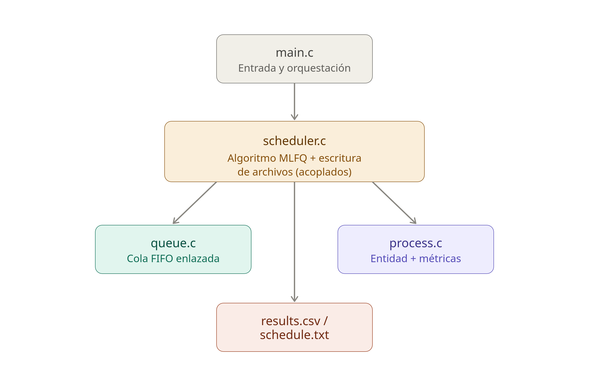

# Implementación de scheduler con políticas MLFQ

## Resumen del proyecto

Este es un simulador de planificación de procesos con el algoritmo MLFQ (Multi-Level Feedback Queue), con 3 colas de prioridad, quantums crecientes, aging por priority boost, y salida en `` `results.csv` ``(donde se puede encontrar las métricas calculadas en el ejercicio)  `` ` schedule.txt` `` -donde se construye el diagrama de Gantt, para comprender mejor, el desplazamiento de los procesos-. Está organizado en 4 módulos: main.c (entrada/orquestación), process.h/c (entidad Proceso + métricas), queue.h/c (cola FIFO enlazada) y scheduler.h/c (algoritmo MLFQ + generación de reportes).

## Decisiones de diseño y justificación

### Separación de módulos por responsabilidades
Este código divide la implemetación del scheduler por responsibilidades utilizando 3 conceptos claros: Process, Queue y Scheduler

 - Process: En el archivo .h se define la entidad proceso que utiliza el scheduler con todos campos requeridos en el enunciado del laboratorio.
 - Queue: En estos archivos tenemos el .h en que se define la entidad Cola y que nos permite crear las colas de los procesos y el .c que utiliza la estructura y crea las colas durante la simulación.
 - Scheduler: Como en los casos anteriores, tenemos los archivos .h donde se define la entidad del scheduler y el archivo .c que implementa la funcionalidad.

## Patrones y/o principios

### Funciones estáticas 
Las funciones estáticas se utilizan para evitar contaminar el espacio de nombres global y deja claro qué es API pública (scheduler.h) en contraste con detalle de la implementación.

### Manejo defensivo de errores
En este proyecto se realiza una verficación sobre ``realloc`` y ``fopen``. En el primer caso se crea una variable temporal, para evitar que en caso de falla, se pierda el puntero original. 

En el caso de ``fopen`` devuelve NULL si no pudo abrir/crear el archivo (por ejemplo, sin permisos de escritura en el directorio, o disco lleno). El patrón es simple: revisar inmediatamente si el puntero es NULL antes de usarlo. Si intentaras usar file sin este chequeo y fopen hubiera fallado, cualquier fprintf(file, ...) posterior causaría comportamiento indefinido (probablemente un crash).

### DRY
En este proyecto no hay código duplicado lo que representa una aplicación del principio Don't Repeat Yourself.

## Esquema del proyecto

